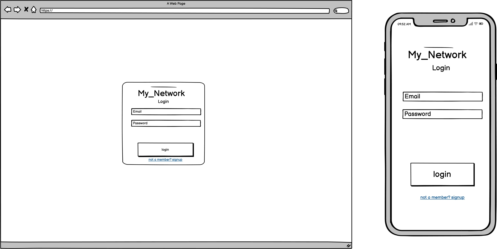
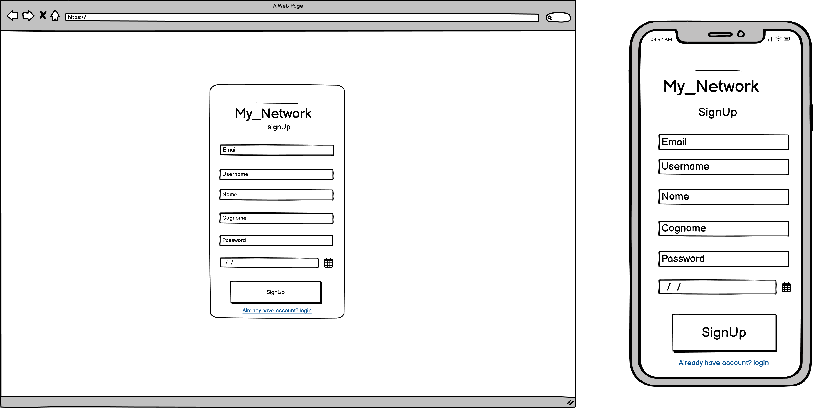
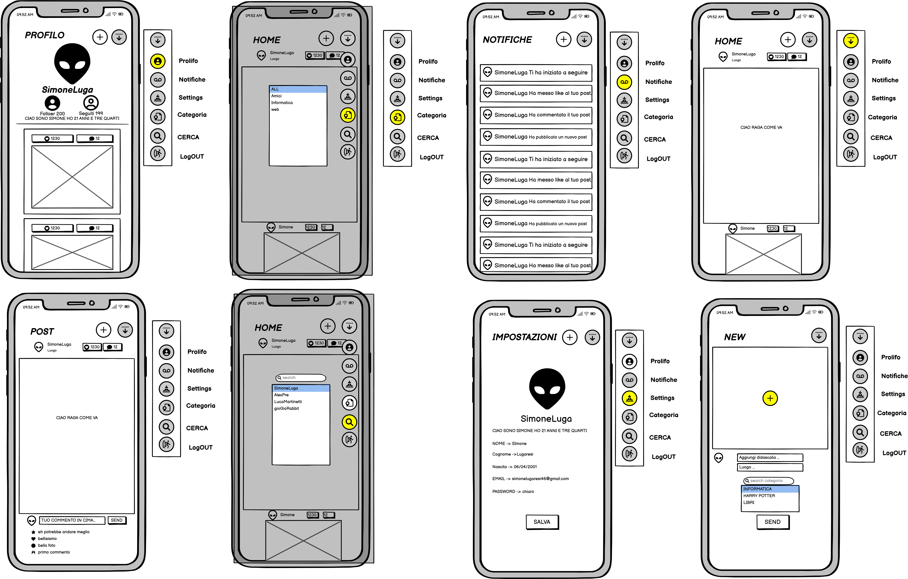
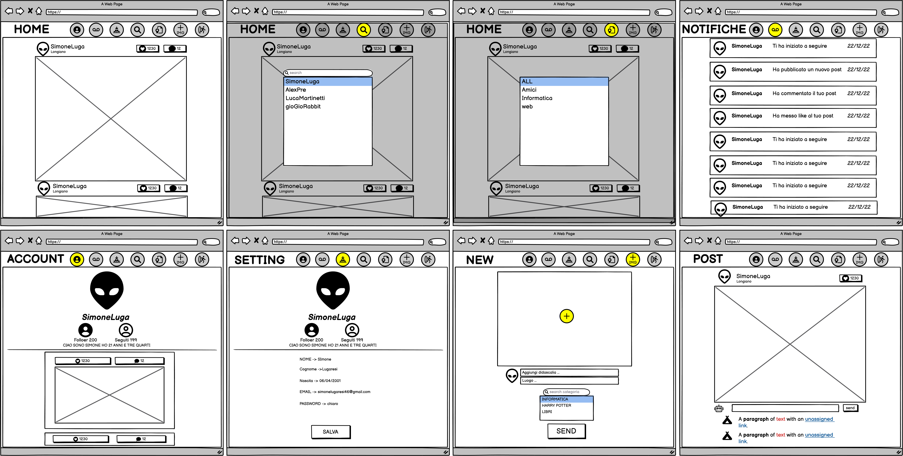
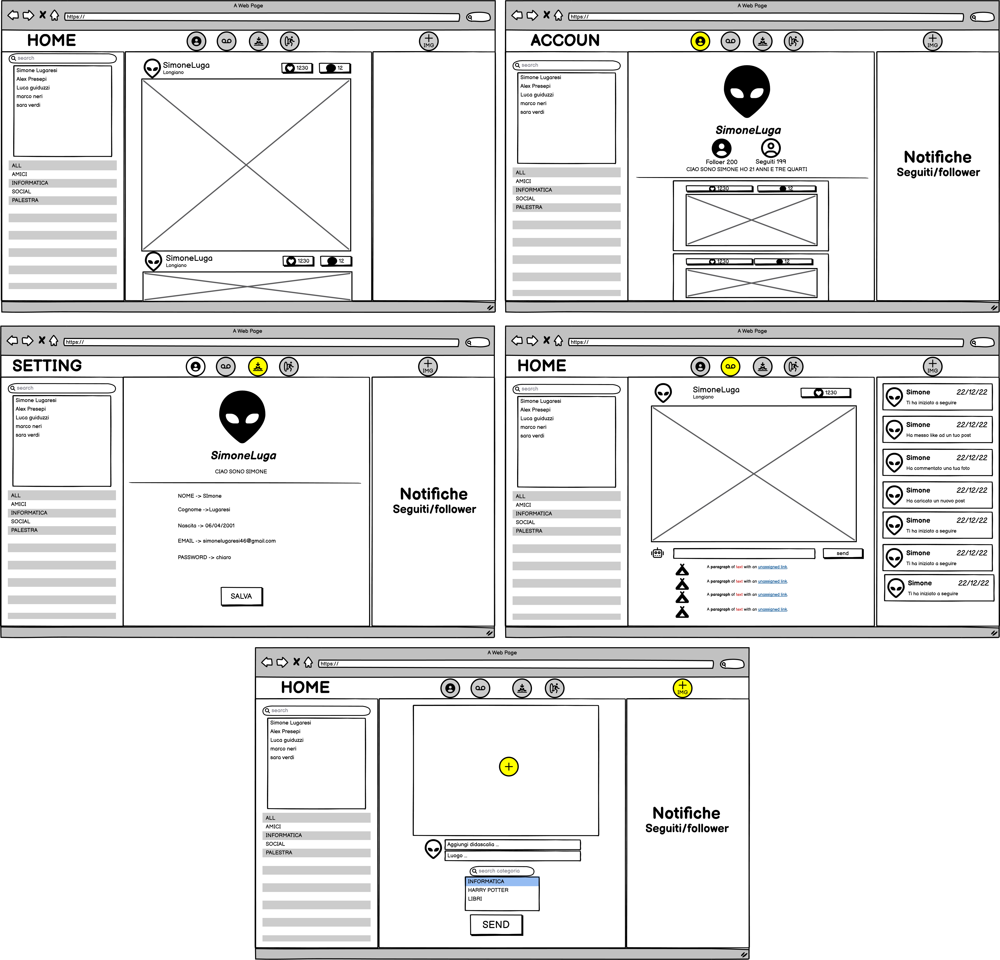

# WebProject-MyNetwork
Elaborato di Tecnologie Web (2022/2023)

## Obbiettivo
applicazione web accessibile e
responsive che metta a disposizione le
funzionalità più comuni di un social network

## Istruzioni

Scaricare la repository

    git clone repo

Avviare localhost ed eseguire DBcreate.sql e infine creare l'username nel db come scritto nel readme.
Una volta avviato il tutto e aperto il sito decidere se si vuole registrare direttamente un altro account o entrare con un account di default 

    Username: Default Email: def@test.com Password: test

## Specifiche
  - Qunado si inserisce una password nel database viene effetuato il salting in modo che l hash di due password uguali sia diverso attraverso.
  - Per evitare attacchi di SQL Injection abbiamo usato gli statement per le query in modo da creare query con dei parametri a cui vengono successivamente inviati i vari valori.
  - tutte le password inviate dal client in fase di registrazione, login, cambiamento password sono inviate crittografate al server cosi da non girare in rete in chiaro. 
  - caricamento dinamico post: Per non fare richieste troppo corpose al server, il caricamento dei post nella home avviene parzialmente, e solamente quando si avrà visto la prima parte di post caricati in automatico farà la ricerca dei post atecedenti da visualizzare.
  - ricerca dinamica user: per iniziare a seguire/visualizzare i profili di altri utenti abbiamo implementato la ricerca senza bottone di invio, ma che dinamicamente in base a ciò che scrivi ti ricerca un potenziale utente.
  - categorie: per dare la possibilità a tutti di utilizzare il social e contemporaneamente rispettare la richiesta della tematica abbiamo inserito le categorie, che permettono all'utente di filtrare i post in base a ciò che vuole vedere (es. Informatica, Palestra, Viaggi) e allo stesso tempo permette quando si carica un post di assegnargli un categoria di appartenenza.
  
## Template
La procedura di creazione del design è stata:
  - Creazione di di mockup basi
  - Condividerli con potenziali utilizzatori del social per farci dare cosigli su come spotare/rimuovere/aggiungere item che secondo loro miglioravano l'esperienza.
  - Creazione di nuovi e definitivi mockup dai quali abbiamo iniziato la creazione del sito.
 
Abbiamo usato Balsamiq per la creazione dei mockup.

## Linguaggi
 - html
 - css
 - js
 - php
## Authors
  Simone Lugaresi - simonelugaresi@studio.unibo.it - [SimoneLuga](https://github.com/simoneLuga)
  
  Alex Presepi - alex.presepi@studio.unibo.it - [pr3ss](https://github.com/pr3ss)
## License

